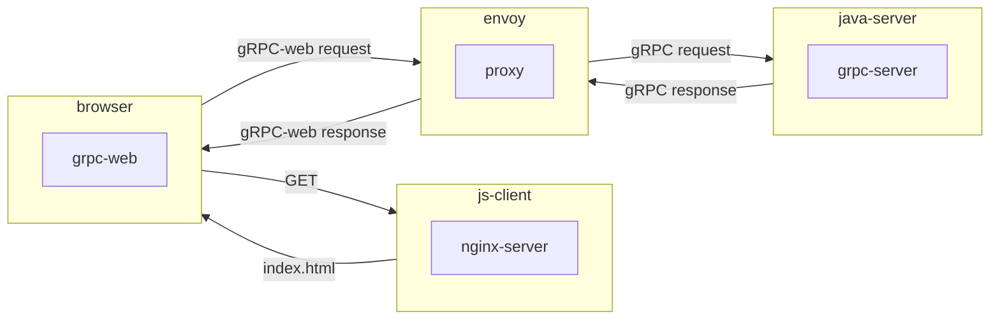
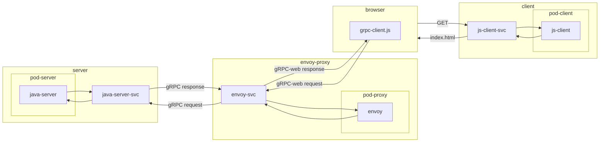

# Kubernetes

This document explains how to deploy the java-server gRPC service on Kubernetes.

## Prerequisite

- Basic knowledge in Kubernetes
  - [Overview](https://kubernetes.io/docs/concepts/overview/)
  - [Services](https://kubernetes.io/docs/concepts/services-networking/service/)
  - [Pods](https://kubernetes.io/docs/concepts/workloads/pods/)
  - [Deployments](https://kubernetes.io/docs/concepts/workloads/controllers/deployment/)
- Basic knowledge in [Docker](https://docs.docker.com/)
- Have docker

## Setup minikube (local)

- Install [minikube](https://formulae.brew.sh/formula/minikube).

```sh
brew install minikube
```

> Use the default docker driver.

- Start minikube or connect your kubectl to your cluster.

```sh
minikube start
```

- Expose the services to your local machine in a separate terminal.

```sh
minikube tunnel
```

> This will dynamically expose new services .

## Application architecture

### Java server with javascript client



## Kubernetes architecture



## Deployments

### Java server

- [Build the app](../java-server/README.md).

- Build the *java server* [Docker image](../java-server/Dockerfile).

```sh
docker build -t java-server ../java-server
```

> Verify that the image name in the [java-server.deployment.yml](java-server.deployment.yml) is the same as you the tag define in the docker build command.

> If you use a external image or if you push your image on a external server, you need to change the *imagePullPolicy* to *IfNotPresent*.

- Load the image into minikube.

```sh
minikube image load java-server
```

> This command can take some time.

- Create the service and deployment with the configurations files.

```sh
kubectl apply -f java-server.service.yml -f java-server.deployment.yml
```

> Your service will already be expose because you have a tunnel open.

You can now get the service informations and see the external IP and port to access it.

```sh
minikube get services
```

You will get a similar result as:

```sh
NAME                  TYPE           CLUSTER-IP       EXTERNAL-IP   PORT(S)          AGE
java-server-svc       LoadBalancer   10.100.214.221   127.0.0.1     9090:31723/TCP   19m
kubernetes            ClusterIP      10.96.0.1        <none>        443/TCP          21m
```

You can now communicate with this service from your local application. In this example: *localhost:9090*.

### Javascript client

- Build the [java-server app](../java-server/README.md)

- Build the docker java-server image

```sh
docker build -t java-server ../java-server
```

- Build the envoy Docker image.

```sh
docker build -t envoy-grpc-web-proxy ../envoy-grpc-web-proxy
```

> Verify that the image name in the [envoy.deployment.yml](envoy.deployment.yml) is the same as you the tag define in the docker build command.

> If you use a external image or if you push your image on a external server, you need to change the *imagePullPolicy* to *IfNotPresent*.

- Load the image into minikube.

```sh
minikube image load envoy-grpc-web-proxy
```

> This command can take some time.

- Create the envoy proxy and java server deployment and service.

> Verify that the port setup in the [envoy.yaml](../envoy-grpc-web-proxy/envoy.yaml) is correct.

```sh
kubectl apply -f java-server_envoy.deployment.yml -f java-server_envoy.service.yml
```

- Get the envoy proxy ip and port and verify they match the one in the [grpc-client.js](../js-client/webapp/src/grpc-client.js) file.

```sh
kubectl get services
```

```sh
NAME              TYPE           CLUSTER-IP     EXTERNAL-IP   PORT(S)          AGE
envoy-svc         LoadBalancer   10.111.236.9   127.0.0.1     8080:31719/TCP   6m25s
java-server-svc   LoadBalancer   10.96.99.227   127.0.0.1     9090:31419/TCP   13m
kubernetes        ClusterIP      10.96.0.1      <none>        443/TCP          15m
```

> If you don't see any external IP, this mean you forgot to open the minikube tunnel.

- [Build the app](../js-client/README.md).

- Build the js-client image.

```sh
docker build -t js-client ../js-client
```

> Verify that the image name in the [js-client.deployment.yml](js-client.deployment.yml) is the same as you the tag define in the docker build command.

> If you use a external image or if you push your image on a external server, you need to change the *imagePullPolicy* to *IfNotPresent*.

- Load the image into minikube

```sh
minikube image load js-client
```

> This command can take some time.

- Create the js-client deployment and service.

```sh
kubectl apply -f js-client.deployment.yml -f js-client.service.yml
```

You should see your deployments, pods and services now.

```sh
kubectl get deployments
```

```sh
kubectl get pods
```

```sh
kubectl get services
```

You can now access your js-client through the service *js-client-svc* ip and port.
The client will communicate with the envoy proxy and that will transform http/1 into http/2 request to be able to communicate with the server.

## Clean up

### Delete all services

```sh
kubectl delete --all services
```

### Delete all deployments

```sh
kubectl delete --all deployments
```

### Stop minikube

```sh
minikube stop
```

### Delete minikube Cluster

```sh
minikube delete
```